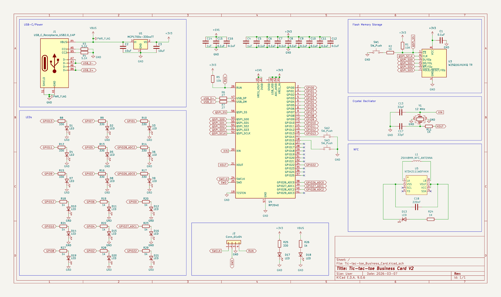

# Tic-Tac-Toe Business Card

**A playable RP2040 business card with a printed NFC antenna and a minimax computer opponent.**

[PCB layout](#pcb-layout) · [NFC design](#passive-nfc-and-antenna) · [Demos](#see-it-work) · [Schematic](#schematic) · [Design files](#design-files)

## PCB layout

The layout combines a large copper-coil NFC antenna with the game interface and embedded electronics. The **18 game LEDs form nine dual-colour cells**, giving each player one indicator per square; Next and Select buttons provide the controls.

## What I built

- Designed the RP2040 board, LED interface, USB-C connection and passive NFC circuit.
- Integrated a **25 × 48 mm PCB copper-coil antenna** with an **NT3H2111 NFC tag**.
- Implemented two-player gameplay and a **minimax opponent with alpha-beta pruning**, which skips search branches that cannot improve the chosen move.
- Completed two PCB revisions, resolving the initial NFC fault and demonstrating both gameplay and tap-to-open linking.

## Passive NFC and antenna

The coil is part of the PCB copper, connected to the NFC tag's antenna terminals. A compatible phone supplies the field needed for passive **13.56 MHz** NFC reading, so the portfolio link can be read **without USB power**. Gameplay uses the powered RP2040 and LED circuit.

The grid uses 18 LEDs; three additional indicators sit outside the nine game cells.

## See it work

| Demonstration | Watch |
|---|---|
| Two-player game | [Gameplay video](https://youtube.com/shorts/xTpW4rk7Zjw) |
| Computer opponent | [Minimax gameplay](https://youtu.be/wkJYNbXEyfI) |
| Passive NFC | [Phone tap → portfolio link](https://youtube.com/shorts/Xky8sBx_JWE) |

## Schematic

[Full-resolution schematic](assets/schematic.svg) · [KiCad schematic](Tic-tac-toe_Business_Card.kicad_sch)

## 3D views

Original board renders:

| Front | Back |
|---|---|
|  |  |

## Design files

| Resource | Link |
|---|---|
| KiCad project | [Project file](Tic-tac-toe_Business_Card.kicad_pro) |
| Routed board | [PCB source](Tic-tac-toe_Business_Card.kicad_pcb) |
| Copper layers | [Front](assets/Tic-tac-toe_Business_Card-F_Cu.svg) · [Back](assets/Tic-tac-toe_Business_Card-B_Cu.svg) |
| NFC footprint | [25 × 48 mm antenna source](lib/NFC_Tic_Tac_Toe.pretty/25X48MM_NFC_ANTENNA.kicad_mod) |
| Manufacturing exports | [Production files](production/) |

The repository contains the hardware design and demonstration assets. The gameplay implementation is demonstrated in the videos; a complete firmware release is not currently included here.

Designed and built by Hung-Chi Wang.
