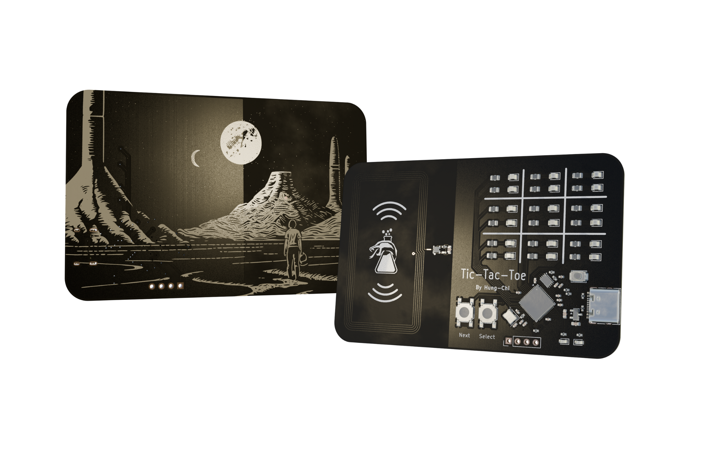
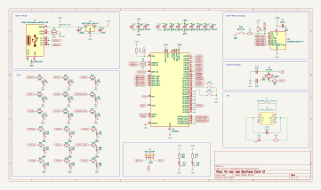
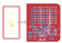
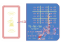
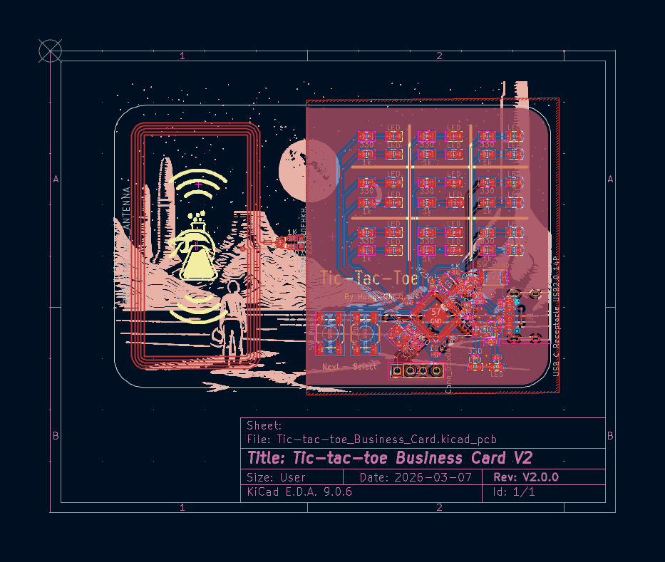
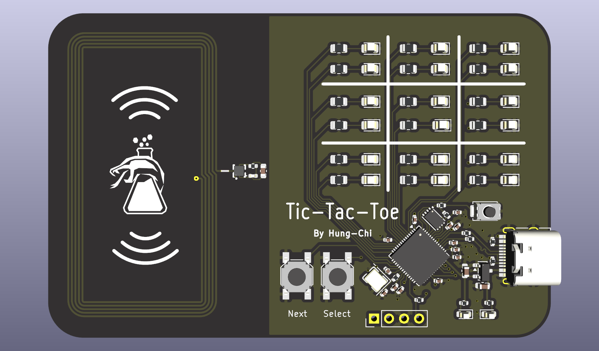
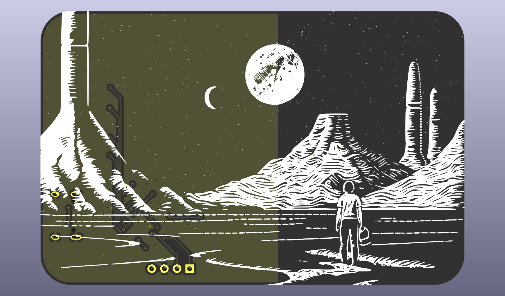

# Tic-Tac-Toe Business Card
This is a unique portfolio card that allows users to play tic-tac-toe on it. It also includes NFC feature to link to your favorite website!

Full tic-tac-toe gameplay experience
NFC feature that navigates others to my github link

Video Demo: https://www.youtube.com/watch?v=_6fU3BlMHlY

## Features
- Full tic-tac-toe gameplay experience
- NFC feature that navigates others to my github link
## Components
- RP2040 + Crystal + Flash Storage
- USB-C for power supply + communication
- NFC + antenna
## Designs

